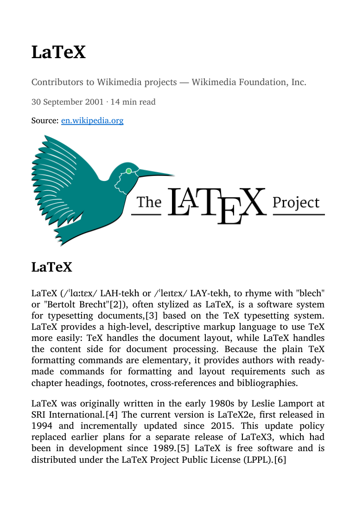

# digest

Compile a list of article URLs into a formatted EPUB digest for e-readers — like a personal magazine. A print-ready PDF via LaTeX is available as an extra (`--format pdf`).

## What it does

Give `digest` a list of article URLs and it produces `digest.epub`: one chapter per article, with cover, table of contents, and minimal styling so your reader's own fonts apply. For each article it:

- Scrapes the body text with [trafilatura](https://trafilatura.readthedocs.io/)
- Extracts metadata (title, author, publication, date) from schema.org JSON-LD (all blocks, `@graph` expanded, article types preferred), falling back to Open Graph tags, `<time>`/meta tags, and trafilatura's own metadata
- Downloads the hero image (`og:image`), author avatar, publication favicon, and any inline body images (deduplicated by URL and by content; tiny tracker/placeholder images skipped)
- Links each chapter header back to the original article

## Sample

`samples/digest.epub` (built from a Wikipedia article and a Python Insider post; source images in `samples/digest_images/`):

| Cover | Chapter |
|---|---|
|  |  |

Rendered here with default reader styling — on your own device the fonts are yours.

## Formats

| | EPUB (default) | PDF (extra) |
|---|---|---|
| Built with | ebooklib (no system dependencies) | XeLaTeX or pdflatex |
| Typography | your reader's settings | EB Garamond, A5 two-column |
| Navigation | chapters + TOC | table of contents |
| Source links | linked chapter headers | source domain in TOC |
| Cover | first hero image | title page |
| Best for | e-readers, phones | printing |

## Metadata sources

First hit wins in each row:

| Field | Sources |
|---|---|
| Title | JSON-LD `headline`/`name` (cross-checked against `og:title`) → `og:title` → `twitter:title` → trafilatura → `<title>` |
| Author | JSON-LD `author`/`creator` (all authors) → `author`, `article:author`, `twitter:creator`, `parsely-author`, `byl`, `dcterms.creator` meta tags → `rel="author"` link → trafilatura → "Unknown" |
| Date | JSON-LD `datePublished` → `article:published_time` → common date meta tags → `<time>`/`itemprop` → trafilatura → `dateModified` |
| Publication | JSON-LD `publisher`/`isPartOf` → `og:site_name` → `application-name` |

## Requirements

**Python packages**

```
pip install -r requirements.txt
```

```
trafilatura>=1.8
beautifulsoup4>=4.12
requests>=2.31
jinja2>=3.1
Pillow>=10.0
lxml>=5.0
ebooklib>=0.18
```

**System (PDF output only)**

- `xelatex` (TeX Live or MiKTeX) — default engine; `pdflatex` also supported via `--engine pdflatex`
- The following LaTeX packages (all included in a standard TeX Live install):
  `geometry`, `iftex`, `fontspec`, `microtype`, `graphicx`, `hyperref`,
  `parskip`, `tocloft`, `xcolor`, `float`, `lettrine`, `placeins`
- For XeLaTeX: the fonts **EB Garamond**, **Latin Modern**, **Noto Serif**, and
  **EBGaramond-Initials.otf** must be installed as system fonts
- For pdflatex: `ebgaramond`, `noto-serif`, `GoudyIn`, `fontenc`, `inputenc`

## Usage

```
python digest.py URL [URL ...] [-o OUTPUT] [--format FORMAT]
                   [--no-pdf] [--engine ENGINE] [-y]
```

### Basic example

```sh
python digest.py \
  https://www.theatlantic.com/some-article \
  https://arstechnica.com/some-story \
  https://www.nature.com/some-paper
```

Produces `digest.epub` and a `digest_images/` directory in the current folder. Before rendering, the scraped title/author/publication of each article is shown for interactive confirmation (articles with an unknown author are flagged); press Enter to proceed or enter a number to edit.

### Options

| Flag | Default | Description |
|---|---|---|
| `-o OUTPUT` | `digest` | Base name for output files (`.epub`, `.tex`, `.pdf`, `_images/`) |
| `--format FORMAT` | `epub` | `epub`, `pdf`, or `both` |
| `--no-pdf` | off | Write the `.tex` file but skip running the LaTeX engine |
| `--engine ENGINE` | `xelatex` | LaTeX engine: `xelatex` or `pdflatex` |
| `-y`, `--yes` | off | Skip the interactive metadata confirmation step |

### PDF extra

`--format pdf` (or `both`) additionally produces a typeset two-column PDF on A5 paper: a table of contents (title + author per entry) followed by one article per page, each with a full-width hero image beneath the title block. The body is set in EB Garamond throughout; the LaTeX engine is run twice to resolve table-of-contents page numbers.

## Output layout

```
digest.epub         — EPUB for e-readers (--format epub or both)
digest.tex          — LaTeX source (--format pdf or both)
digest.pdf          — compiled PDF (--format pdf or both)
digest_images/
  hero_0.jpg        — hero image for article 0
  art0_0.png        — first inline image in article 0
  art0_1.jpg        — second inline image in article 0
  avatar_0.png      — author avatar for article 0
  favicon_0.png     — publication favicon for article 0
  ...
```

Each article page:

```
┌─────────────────────────────┐
│  Title                      │  ← EB Garamond, bold
│  [avatar] Author — Pub      │  ← small, italic
│  One-line author bio        │
│  [favicon] Date · N min read│
│  ─────────────────────────  │
│  [hero image, full width]   │
├──────────────┬──────────────┤
│ Body text in │ EB Garamond  │
│ two columns  │ throughout   │
└──────────────┴──────────────┘
```

## Notes

- **Source URLs.** The EPUB links each chapter header to its source article. The PDF contains no links; its table of contents shows the source domain and path under each entry instead.
- **Duplicate images are skipped.** Inline images repeating the hero image or each other (by URL or by content) are embedded only once; images smaller than 60 px in either dimension (tracking pixels, placeholders, icons) are dropped.
- **Failed image downloads are silently skipped.** The document is produced regardless of whether individual images can be fetched.
- **SVG images are skipped** (the PDF engines cannot include them). WEBP, ICO, GIF, and BMP images are converted to PNG via Pillow if available; otherwise skipped.
